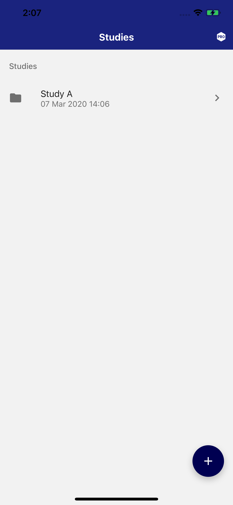
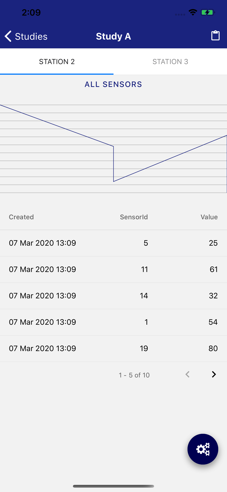
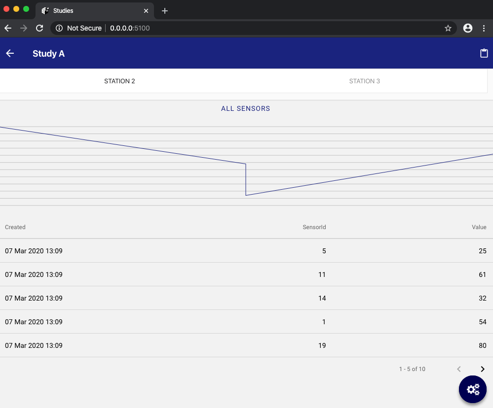
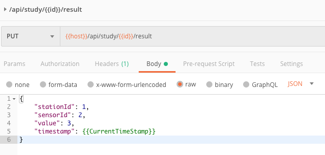
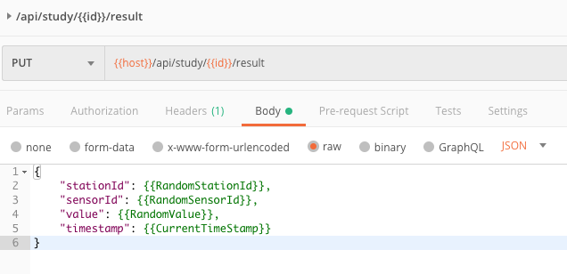
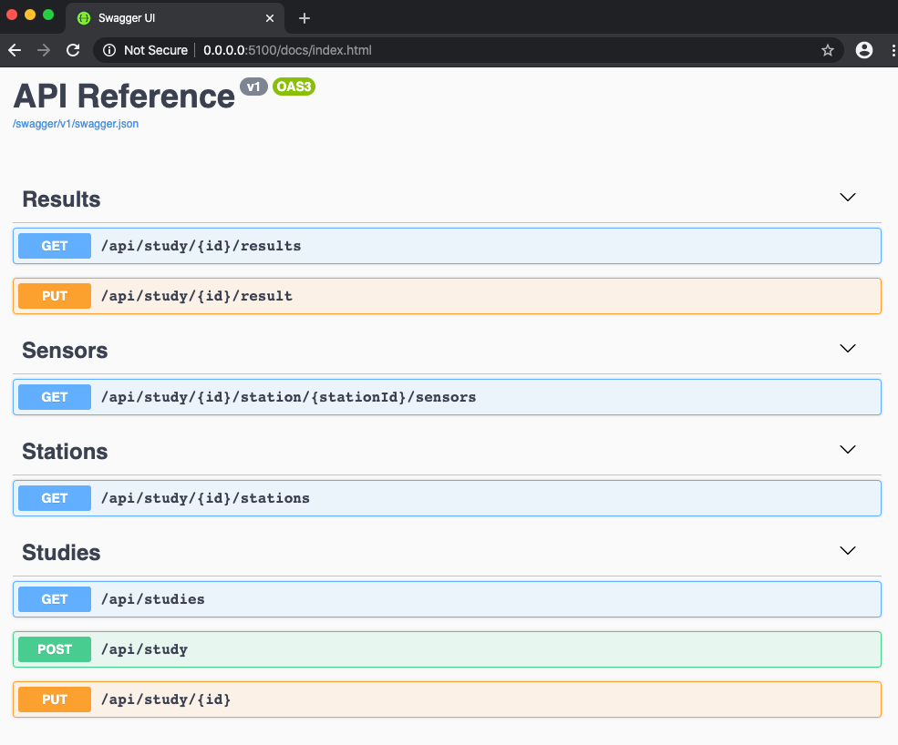

# Application for storing laboratory test results.
<p align="center">


</p>
<p align="center">

</p>

# Deployed application
Sample app is hosted on Heroku platform: https://studies-pk.herokuapp.com/
Mobile app can be run by scanning QR code using Expo app: https://expo.io/@mattkobosko/studies
API reference is available under: https://studies-pk.herokuapp.com/docs/index.html

# Using the API
Use the REST API add new Study results.




Full API documentation is available under /docs/index.html.



# Overview
## Tech Stack C# + TypeScript
- .NET Core 3.0
- Mongo 4.2
- Expo v36 + React Native (0.61.4) + React Native Web

# Development
## Prerequisites
### Base
- [git v2.21.1+](https://git-scm.com/downloads)
- [NodeJS v10+](https://nodejs.org/en/)
- [yarn v1.17.3+](https://classic.yarnpkg.com/en/docs/install)
- [expo-cli v3.11.3](https://docs.expo.io/versions/latest/workflow/expo-cli/)
- [Docker v19+](https://www.docker.com/products/docker-desktop)
- [.NET Core SDK v3.0.103+](https://dotnet.microsoft.com/download)

```bash
# Verify if installed:
./infrastructure/verify.sh
```
### IDEs
- Visual Studio Code + extensions: ESLint and Prettier
- JetBrains Rider / Visual Studio
- Postman
- Mongo Express
- Android Emulator / iOS Simulator

## Structure

| Directory | Content | Opened by |
| - | :-: | -: |
| root | general purpose | Visual Studio Code |
| client | mobile / web app source | Visual Studio Code |
| docs | documentation files | Visual Studio Code |
| infrastructure | dev infrastructure files | Visual Studio Code |
| server | API + SPA host source  | JetBrains Rider / Visual Studio |
| Studies.postman_collection.json | API test  | Postman |


## Run the project locally
### Clone and run infrastructure
```bash
git clone https://github.com/miazga/Studies.git
cd Studies
./infrastructure/verify.sh
./infrastructure/start.sh
```
### Run the Server
- Open server/Server.sln in JetBrains Rider / Visual Studio
- Hit debug/run on the Server.API project

### Run the client (Mobile)
- Open client in Visual Studio Code and open Terminal (CTRL + \` or CMD + \`)
```bash
yarn
expo start
```

### Run the client (Web)
- Open client in Visual Studio Code and open Terminal (CTRL + \` or CMD + \`)
```bash
rm -rf node_modules/ && yarn
expo web
```

### Table of networking
| Service | Host + Port | Protocol
| - |  :-: | -: |
| Server.API | 0.0.0.0:5100 / localhost:5100 | http |
| Expo packager | {localnetwork}:19002 | http |
| Client Web | {localnetwork}:19006 | http |
| Mongo | localhost:27017 | mongodb |
| Mongo Express | localhost:8081 | http |

# Deployment
## Server API should be deployed as a docker container
Steps to deploy into free Heroku app:
- create free app on Heroku
- find and replace studies-pk.herokuapp.com with your target host/domain
- build a static SPA by running
```bash
cd client
./scripts/build-web.sh
```
- modify ./server/scripts/build-and-push.sh script with your settings
- build and deploy an app by running
```bash
cd server
./scripts/build-and-push.sh
```
- setup connection string for the Mongo using Heroku panel add add a config:
MongoDbSettings__ConnectionString="mongodb://{yourdatabase}"
- to build mobile app you must setup your account and run
```bash
cd client
rm -rf node_modules/ && yarn
expo build:android / expo build:ios
```
Can either install the APK generated in the build process or install Expo app (on both Android / iOS)

# Using the API
- Import Studies.postman_collection.json into Postman
- Setup host and id for the study to use (local server api http://localhost:5100)

# FAQ / Troubleshooting
- You can create a free Mongo cluster using Atlas Cloud -> https://www.mongodb.com/cloud/atlas/azure-mongodb
- To make your Atlas cluster reachable from anywhere make sure to whitecard all the IPs in security panel
- To configure RealTime udpates via SignalR on local environment make sure to confiugure AddCorsDefinitions() method with a proper url for Expo packager (default set to http://192.168.8.113:19006):
```csharp
public static IServiceCollection AddCorsDefinitions(this IServiceCollection services)
{
    services.AddCors(options => options.AddPolicy("DevCorsPolicy", 
        builder =>
        {
            builder.AllowAnyMethod()
                .AllowAnyHeader()
                .WithOrigins("http://192.168.8.113:19006", "http://localhost:5100")
                .AllowCredentials();
        }));
    
    ...
}
```
- Data Structure - example Mongo document of the study:
```
{
    _id: BinData(3, 'TspP3zKBz0690SUPqFGEMg=='),
    Name: 'Study A',
    Results: [
        {
            StationId: 3,
            Created: ISODate('2020-03-07T12:09:11.000Z'),
            SensorId: 16,
            Value: '89'
        },
        {
            StationId: 2,
            Created: ISODate('2020-03-07T12:09:12.000Z'),
            SensorId: 10,
            Value: '48'
        },
        {
            StationId: 2,
            Created: ISODate('2020-03-07T12:09:26.000Z'),
            SensorId: 9,
            Value: '55'
        }
    ],
    Created: ISODate('2020-03-07T13:06:52.828Z'),
    State: 1
}
```


# TODO
- [x] Create SPA from React Native Project
- [x] Real Time updates using SignalR
- [x] Deploy on Heroku
- [ ] Add user authentication
- [ ] Use RabbitMQ as a batch for high performance